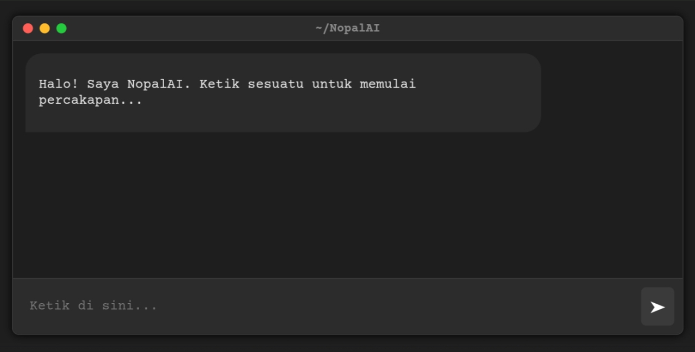

# TerminalAI Chatbot



This open-source project is perfect for developers, students, and hobbyists who want to build their own AI assistant or experiment with LLM interfaces.

## 🌟 Features

* Chat interface styled like a terminal
* Syntax highlighting and Markdown support
* Typing animation for AI responses
* Clean and responsive UI
* Gemini API request handled securely via Cloudflare Worker

---

## 🚀 Live Demo

> *[Demo](https://nopal-ai.pages.dev/)*

---

## 📁 Project Structure

```bash
📦 root
├── index.html        # Main HTML file
├── script.js         # Chat logic and Gemini API handler (frontend)
├── style.css         # UI styling
```

---

## 🛠️ Getting Started

### 1. Clone the Repository

```bash
git clone https://github.com/novalattasya/TerminalAI-chatbot.git
cd TerminalAI-chatbot
```

### 2. Edit Configurations

In `script.js`:

```js
const workerUrl = "https://your-cloudflare-worker-url.workers.dev/";
const MAX_MESSAGES = 50; // Change conversation limit as needed
```

You may also customize the AI's personality prompt:

```js
const prompt = [
  "You are AIAssistant, a smart and friendly AI developed using Google's Gemini API..."
];
```

---

## 🧠 How It Works

1. User types a message.
2. The message is added to conversation history.
3. A full prompt (chat history + personality) is generated.
4. Prompt is sent to a Cloudflare Worker.
5. Worker securely relays the prompt to the Gemini API.
6. AI response is returned and displayed in the chat.

---

## ☁️ Deploy Cloudflare Worker (Backend)

### 1. Write Your Worker

Use this template:

```js
export default {
  async fetch(request, env, ctx) {
    // Allowed domains
    const allowedOrigins = ["https://your-site.com"]; # Or you can use "*" for development
    const origin = request.headers.get("Origin");
    const isAllowedOrigin = allowedOrigins.includes(origin);

    const corsHeaders = {
      "Access-Control-Allow-Origin": isAllowedOrigin ? origin : "null",
      "Access-Control-Allow-Methods": "POST, OPTIONS",
      "Access-Control-Allow-Headers": "Content-Type",
    };

    if (request.method === "OPTIONS") {
      return new Response(null, { status: 204, headers: corsHeaders });
    }

    const body = await request.json();
    const userPrompt = body.prompt;

    const GEMINI_API_KEY = env.GEMINI_API_KEY_SECRET;
    const geminiUrl = `https://generativelanguage.googleapis.com/v1beta/models/gemini-2.0-flash:generateContent?key=${GEMINI_API_KEY}`;

    const response = await fetch(geminiUrl, {
      method: "POST",
      headers: { "Content-Type": "application/json" },
      body: JSON.stringify({ contents: [{ parts: [{ text: userPrompt }] }] })
    });

    const data = await response.json();
    const reply = data.candidates?.[0]?.content?.parts?.[0]?.text || "No content generated.";

    return new Response(JSON.stringify({ reply }), {
      status: 200,
      headers: { ...corsHeaders, "Content-Type": "application/json" },
    });
  }
};
```

### 2. Set Your Secret

```bash
wrangler secret put GEMINI_API_KEY_SECRET
```

### 3. Deploy the Worker

```bash
wrangler publish
```

---

## ⚙️ Local Testing

You can test this project by simply opening `index.html` in your browser after editing the `workerUrl`.

---

## 💡 Tips for Customization

* Change AI tone by editing the system prompt.
* Adjust `MAX_MESSAGES` to control memory length.
* Modify UI colors in `style.css` (e.g., `--bg-color`, `--bubble-bg-ai`).

---

## 📜 License

GPL-3.0 license. Feel free to use, modify, and share.

---

## 👋 Credits

Developed with ❤️ by [Nopal](https://github.com/novalattasya)

Built using Google Gemini API and Cloudflare Workers.
